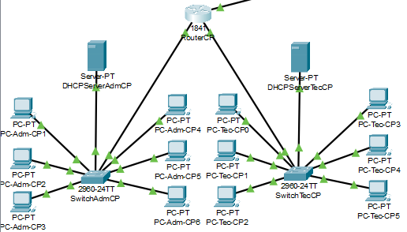
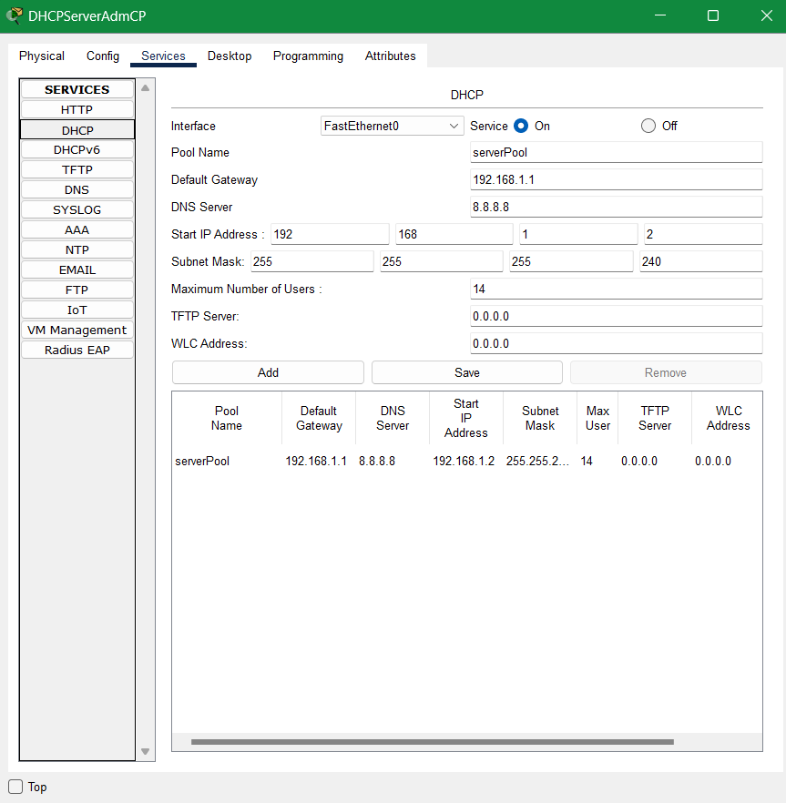
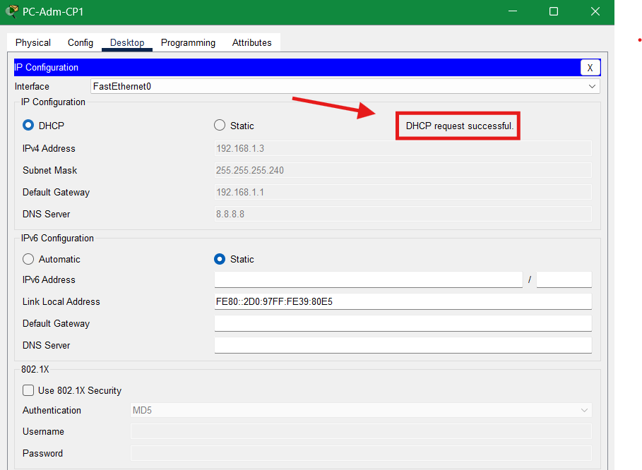

# AV-REDES-001

## Criação das subredes

### Configuração do roteador local

Primeiro, adicionando um roteador modelo 1841 que possui duas entradas `FastEthernet`. Em cada uma das interfaces `FastEthernet` adiciona-se o IP do `gateway` (IP do próprio roteador).
Defini a rede como 192.168.1.0.
No meu caso, como serão 6 PCs em cada subrede, com um roteador e um `Servidor DHCP` em cada, precisarei de, no mínimo, uma máscara com 8 hosts válidos. Então usarei a `máscara` 255.255.255.240, que possui 16 IPs - do qual um é para a rede e outro para o `broadcast` - com 14 hosts utilizáveis.

#### Primeira sub-rede

Ainda no roteador, acessei a interface 0 e defini o `gateway` como 192.168.1.1. No `Servidor DHCP`, defini o IP manualmente como 192.168.1.2 e fui para a aba de services. Nela configurei o `DHCP` conforme a imagem a seguir:

Com o `Servidor DHCP` configurado, acessei a configuração de cada PC, acessei a aba Desktop, acessei a configuração de endereço IP e mudei de static para DHCP, o servidor fez a requisição DHCP e obteve um IP na sub-rede:

Fiz o mesmo para cada PC da sub-rede.

#### Segunda sub-rede

Repliquei as configurações do primeiro na interface 1, apenas mudando o IP do `gateway` para 192.168.1.17 e o do `Servidor DHCP` para 192.168.1.18.

Acessei os
