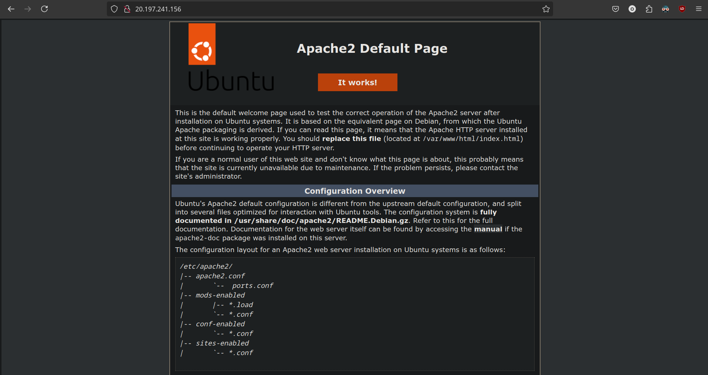
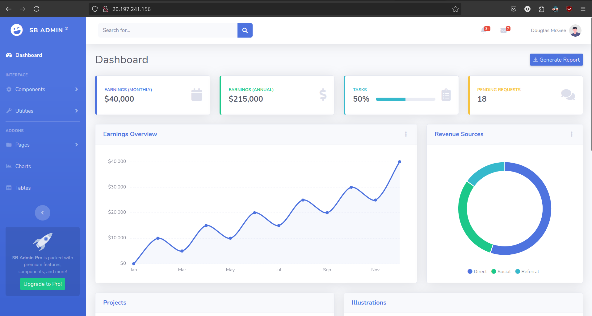
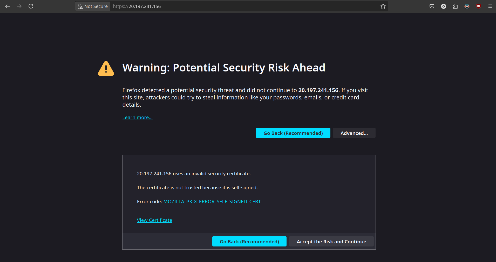
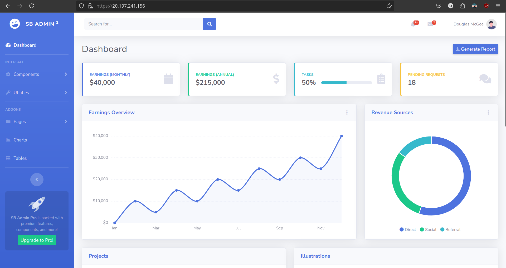

# AC-REDES-001

## Configuração inicial

### Instalação do Apache

Instalei o `Apache` usando o comando

```bash
sudo apt install apache2
```

Depois permiti o uso das portas requisitadas pelo `Apache` com o comando

```bash
sudo ufw allow in "Apache Full"
```

Então acessei o ip do servidor e lá estava a página padrão do `Apache` para o `Ubuntu`


### Instalação do openssl

Para gerar certificados autoassinados, instalei o `openssl`, depois será usado para servir o site com HTTPS

```bash
sudo apt install openssl
```

### Instalação do template

Indo para o site [Start Bootstrap](startbootstrap.com) encontrei um tema e obtive o link de instalação a partir do botão de download.

Instalei usando `wget`

```bash
wget https://github.com/startbootstrap/startbootstrap-sb-admin-2/archive/gh-pages.zip
```

Como o arquivo veio no formato `.zip`, instalei o `unzip` e o usei para descompactar o template

```bash
sudo apt install unzip
unzip gh-pages.zip
```

#### Execução do template

Posteriormente, para baixar as dependencias e executar o template com `Node.js`, instalei o [`nvm` seguindo o guia de instalação](https://github.com/nvm-sh/nvm?tab=readme-ov-file#installing-and-updating) e, com ele instalei o `Node.js` NA VERSÃO 14 (várias dependencias do template já haviam há muito sido preteridas e não funcionam com as versões recentes do Node) juntamente com o `npm`.

## Servindo o template para HTTP

Com o template rodando na porta 3000, agora é necessário redirecionar o tráfego da porta HTTP (80) para a porta 3000.

Como agora o `Apache` não serve apenas um diretório, foi necessário habilitar o seu módulo de proxy.

```bash
sudo a2enmod proxy
sudo a2enmod proxy_http
sudo systemctl restart apache2
```

E então editei o arquivo de configuração

```bash
sudo nano /etc/apache2/sites-available/000-default.conf
```

Adicionando as seguintes linhas:

```xml
    ProxyPreserveHost On
    ProxyPass / http://localhost:3000/
    ProxyPassReverse / http://localhost:3000/
```

E reiniciando novamente o `Apache`

```bash
sudo systemctl restart apache2
```

Acessando o ip no navegador, esse foi o template estave sendo servido corretamente:


## Servindo o template com HTTPS

### Criando um certificado autoassinado

Criei uma pasta para armazenar os certificados

```bash
sudo mkdir -p /etc/apache2/ssl
```

E executei o comando para gerar o certificado autoassinado

```bash
sudo openssl req -x509 -nodes -days 365 -newkey rsa:2048 -keyout /etc/apache2/ssl/selfsigned.key -out /etc/apache2/ssl/selfsigned.crt
```

Em seguida o `openssl` solicitou algumas informações.

Habilitei o módulo ssl do `Apache`

```bash
sudo a2enmod ssl
systemctl restart apache2
```

Editei o arquivo de configuração

```bash
sudo nano /etc/apache2/sites-available/default-ssl.conf
```

Modificando o `SSLCertificateFile` e o `SSLCertificateKeyFile`, para usar os certificado gerado, e adicionando as configurações de proxy `ProxyPass` e `ProxyPassReverse`:

```xml
    SSLCertificateFile /etc/apache2/ssl/selfsigned.crt
    SSLCertificateKeyFile /etc/apache2/ssl/selfsigned.key

    ProxyPreserveHost On
    ProxyPass / http://localhost:3000/
    ProxyPassReverse / http://localhost:3000/
```

E habilitei o site daquela configuração

```bash
sudo a2ensite default-ssl.conf
sudo systemctl reload apache2
```

Agora, ao acessar o ip com HTTPS, o navegador me alertou do risco do certificado autoassinado (não confiável):


Aceitando o risco e continuando, acessei o template com sucesso:

