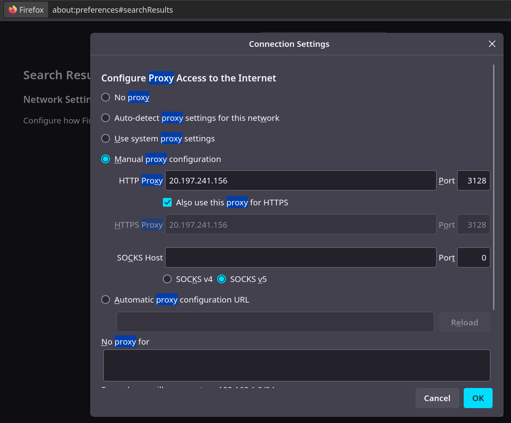
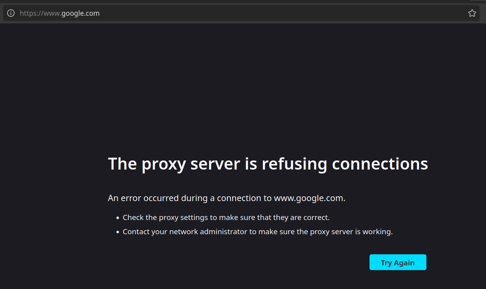

# AC-REDES-002

## Instalação do Squid

Instalei o `Squid` usando o comando

```bash
sudo apt install squid -y
```

## Configuração

Usando o nano, editei o arquivo de configuração do squid

```bash
sudo nano /etc/squid/squid.conf
```

E adicionei as seguintes linhas ao início do arquivo:

```conf
acl all src 0.0.0.0/0
http_access allow all
```

Em seguida reiniciei o squid e verifiquei seu status:

```bash
sudo systemctl restart squid
sudo systemctl status squid
```

## Uso de proxy no Firefox

Alterei as configurações de proxy do Firefox para utilizar o server para HTTP e HTTPS:


## Verificando funcionamento

Executei os seguintes comando para ver os logs de acesso do squid:

```bash
sudo tail -f /var/log/squid/access.log
```

## Bloqueando sites

Para bloquear sites, apenas adicionei as seguintes linhas no arquivo de configuração do squid ANTES DO `allow all`.

```conf
acl toblock dstdomain .facebook.com .google.com
http_access deny toblock
```

Ao tentar acessar o `facebook` ou o `google` no navegador, eles foram bloquados:

