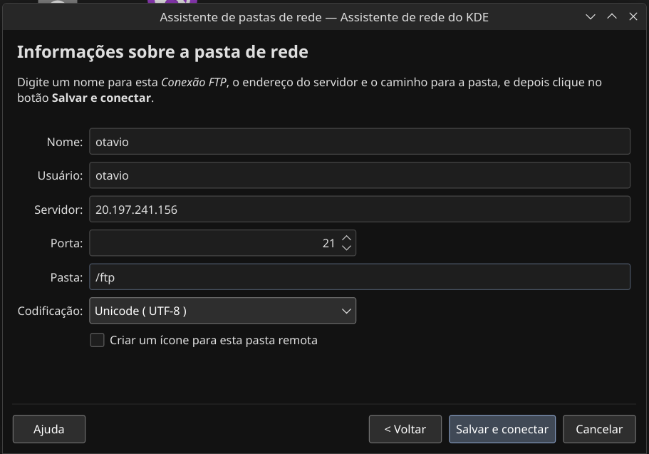

# AC-REDES-003

## Instalação do vsFTPd

Instalei o `vsFTPd` usando o comando:

```bash
sudo apt install vstpd
```

## Configuração do vsFTPd

Nas configurações do vsFTPd, precisei especificar algumas linhas diferentes das fornecidas no passo a passo do exercício, o arquivo ficou assim:

```conf
pasv_enable=YES
pasv_address=20.197.241.156
pasv_min_port=30000
pasv_max_port=30100
listen=YES
listen_ipv6=NO
anonymous_enable=NO
local_enable=YES
write_enable=YES
dirmessage_enable=YES
use_localtime=YES
xferlog_enable=YES
connect_from_port_20=YES
chroot_local_user=YES
chroot_list_enable=YES
ls_recurse_enable=YES
secure_chroot_dir=/var/run/vsftpd/empty
pam_service_name=vsftpd
utf8_filesystem=YES
allow_writeable_chroot=NO
```

Reiniciei o serviço:

```bash
sudo systemctl restart vsftpd
```

## IMPORTANTE

Após pesquisar, descobri que era necessário **especificar um range de portas** para a comunicação FTP, nota-se as linhas:

```conf
pasv_enable=YES
pasv_address=20.197.241.156
pasv_min_port=30000
pasv_max_port=30100
```

onde é especificado o range de portas da `30000` até a `30100`.
Também foi necessário **liberar o acesso a essas portas, juntamente com a porta 21 (FTP), no dashboard da Azure**

## Testando o servidor FTP

### FTP client

Tive problemas de timeout com o `filezilla`, então usei o cliente ftp no terminal (na minha própria máquina Linux, não no servidor):

Instalar cliente FTP:

```bash
sudo apt install ftp -y
```

Conectar-se ao servidor

```bash
ftp 20.197.241.156
```

Usei o comando `ls` dentro do `ftp` para listar os arquivos da pasta a qual me conectei, e lá estava a pasta criada:

```bash
drwxr-xr-x    2 1001     1001         4096 May 29 00:43 ftp
```

### Dolphin

Em seguida, me conectei com o Dolphin (explorador de arquivos do KDE Plasma) em um sistema de arquivos remoto:



E lá conseguir acessar os arquivos na pasta remota
